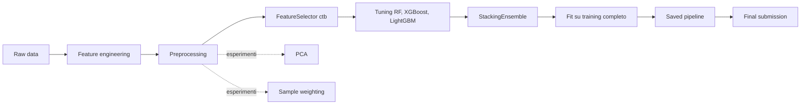

# Richter's Predictor: Modeling Earthquake Damage

Progetto finale del corso di **Fondamenti di Intelligenza Artificiale**.

Il progetto utilizza il dataset della competizione DrivenData **Richter's Predictor: Modeling Earthquake Damage**, relativo agli edifici colpiti dal terremoto del Nepal del 2015.

L'obiettivo è sviluppare una pipeline di Machine Learning per stimare il livello di danno subito dagli edifici a partire da informazioni strutturali, geografiche e d'uso.

La versione qui documentata corrisponde alla versione finale di consegna del progetto.

---

## 1. Obiettivo del progetto

Il task affrontato è un problema di **classificazione multiclasse**.

La variabile target è:

```text
damage_grade
```

Le classi previste sono:

| Classe | Significato   |
| -----: | ------------- |
|      1 | danno basso   |
|      2 | danno medio   |
|      3 | danno elevato |

La metrica principale è la **micro-F1**, coerentemente con la metrica ufficiale della competizione. La micro-F1 aggrega globalmente veri positivi, falsi positivi e falsi negativi sulle tre classi, ed è quindi adatta a valutare la performance complessiva del classificatore.

Sono inoltre considerate come metriche di supporto:

| Metrica       | Ruolo                                                                   |
| ------------- | ----------------------------------------------------------------------- |
| `micro-F1`    | metrica principale per confronto e scelta del modello                   |
| `macro-F1`    | misura la performance media sulle classi, senza pesare per la frequenza |
| `weighted-F1` | misura la performance media pesata per la numerosità delle classi       |

La scelta finale tiene conto della micro-F1 interna, della coerenza metodologica della pipeline e del risultato ottenuto sulla public leaderboard.

---

## 2. Dataset

I file originali della competizione devono essere posizionati nella cartella:

```text
data/raw/
```

La struttura richiesta è:

```text
data/raw/
├── train_values.csv
├── train_labels.csv
├── test_values.csv
└── submission_format.csv
```

Descrizione dei file:

| File                    | Contenuto                                       |
| ----------------------- | ----------------------------------------------- |
| `train_values.csv`      | feature degli edifici del training set          |
| `train_labels.csv`      | target `damage_grade` associato al training set |
| `test_values.csv`       | feature degli edifici del test set              |
| `submission_format.csv` | formato richiesto per la submission finale      |

I dati raw non vengono modificati direttamente. La pipeline carica i file originali, costruisce il dataset di training completo tramite merge su `building_id` e applica preprocessing, feature engineering, feature selection opzionale, tuning e modellazione tramite codice riutilizzabile in `src/`.

---

## 3. Struttura del repository

```text
.
├── data/
│   └── raw/
├── docs/
│   └── decision_log.md
├── models/
│   └── final_pipeline.joblib        # generato localmente, non versionato
├── notebooks/
├── outputs/
│   ├── figures/
│   ├── metrics/
│   └── submissions/
├── src/
│   ├── preprocessing/
│   ├── config.py
│   ├── data_loader.py
│   ├── evaluation.py
│   ├── features.py
│   ├── feature_selection.py
│   ├── featureselector.py
│   ├── final_model.py
│   ├── hyperparameter_tuning.py
│   ├── hyperparameter_tuning_feature_selection.py
│   ├── models.py
│   ├── pipeline_training_model.py
│   └── utils.py
├── main.py
├── requirements.txt
├── README.md
└── LICENSE
```

| Percorso                                      | Ruolo                                                        |
| --------------------------------------------- | ------------------------------------------------------------ |
| `data/raw/`                                   | dati originali della competizione                            |
| `src/preprocessing/`                          | pipeline modulare di preprocessing                           |
| `src/config.py`                               | path, costanti e configurazione finale                       |
| `src/data_loader.py`                          | caricamento dati, merge e split                              |
| `src/features.py`                             | feature engineering compatto                                 |
| `src/featureselector.py`                      | transformer sklearn per feature selection leak-safe          |
| `src/feature_selection.py`                    | metodi di ranking e scoring delle feature                    |
| `src/models.py`                               | baseline, modelli avanzati ed ensemble                       |
| `src/pipeline_training_model.py`              | esperimenti, validazione interna e model comparison          |
| `src/final_model.py`                          | training finale, salvataggio pipeline e generazione submission |
| `src/evaluation.py`                           | metriche, classification report e confusion matrix           |
| `outputs/metrics/`                            | risultati e confronti tra modelli                            |
| `outputs/submissions/`                        | file di submission finale                                    |
| `models/final_pipeline.joblib`                | pipeline finale salvata dopo `train-final`                   |
| `notebooks/`                                  | analisi esplorative e sperimentali                           |
| `docs/decision_log.md`                        | razionale dettagliato delle decisioni metodologiche          |

La logica stabile del progetto si trova in `src/`. I notebook documentano il percorso analitico e sperimentale, mentre l'esecuzione finale avviene tramite `main.py`.

---

## 4. Pipeline ufficiale

La pipeline finale segue due flussi distinti.

Flusso sperimentale e di validazione:

```text
raw data
→ train/validation split
→ preprocessing
→ eventuale feature selection
→ eventuale PCA
→ modello
→ metriche interne
```

Flusso finale di training e submission:

```text
raw data
→ preprocessing
→ CatBoost-based FeatureSelector
→ tuning dei modelli base
→ StackingEnsemble
→ fit sul training set completo
→ salvataggio pipeline
→ submission
```



Tutte le trasformazioni principali sono compatibili con `scikit-learn` e vengono integrate nella pipeline. Questo riduce il rischio di **data leakage**, perché preprocessing, feature selection e PCA vengono fittati solo sul training set o sul fold di training durante la validazione.

| Step                | Componente                   | Ruolo                                                        |
| ------------------- | ---------------------------- | ------------------------------------------------------------ |
| Feature engineering | `src/features.py`            | crea feature aggregate                                       |
| Data cleaning       | `DataCleaner`                | rimuove identificativi, target accidentali e feature escluse |
| Age handling        | `AgeHandler`                 | gestisce il valore speciale `age = 995`                      |
| Geographic encoding | `FrequencyEncoder` / one-hot | codifica variabili geografiche                               |
| Feature selection   | `FeatureSelector`            | seleziona feature tramite ranking CatBoost                   |
| Modeling            | `StackingEnsemble`           | combina RandomForest, XGBoost e LightGBM                     |
| Evaluation          | `src/evaluation.py`          | calcola micro-F1, macro-F1 e weighted-F1                     |

---

## 5. Configurazione finale

La configurazione finale è centralizzata in `src/config.py`.

| Parametro             | Valore finale       |
| --------------------- | ------------------- |
| Modello finale        | `StackingEnsemble`  |
| Split strategy        | `4`                 |
| Feature selection     | attiva              |
| Metodo FS             | `ctb`               |
| Soglia FS             | `0.005`             |
| Numero massimo feature | `30`               |
| PCA                   | disattivata         |
| Sample weighting      | disattivato         |
| Hyperparameter tuning | attivo              |
| Tuning iterations     | `15`                |
| Tuning sample size    | `50000`             |

Configurazione principale:

```python
FINAL_MODEL_NAME = "StackingEnsemble"
FINAL_SPLIT_STRATEGY = 4
FINAL_FEATURE_SELECTION = True
FINAL_FS_METHOD = "ctb"
FINAL_FS_THRESHOLD = 0.005
FINAL_MAX_FEATURES_TO_HOLD = 30
FINAL_USE_SAMPLE_WEIGHT = False
FINAL_USE_PCA = False
FINAL_DO_TUNING = True
FINAL_TUNING_ITER = 15
FINAL_TUNING_SAMPLE_SIZE = 50000
```

La configurazione finale usa uno `StackingEnsemble` costruito a partire da RandomForest, XGBoost e LightGBM. Prima della costruzione dello stacking, i modelli base vengono ottimizzati tramite `RandomizedSearchCV`. La feature selection è integrata nella pipeline tramite `FeatureSelector`, con ranking basato su CatBoost.

La separazione tra `pipeline_training_model.py` e `final_model.py` evita di mescolare esperimenti, validazione interna, training finale e generazione della submission. In questo modo la pipeline sperimentale resta distinta dal workflow conclusivo di training, salvataggio del modello e inferenza sul test set.

---

## 6. Feature engineering e feature escluse

La pipeline applica un feature engineering compatto e interpretabile. Alcuni gruppi di variabili originali vengono sintetizzati in feature aggregate per ridurre la dimensionalità e mantenere il segnale informativo.

Feature aggregate finali:

| Feature                      | Significato                                                |
| ---------------------------- | ---------------------------------------------------------- |
| `total_superstructure_count` | numero di tecniche o materiali strutturali presenti        |
| `total_secondary_use_count`  | numero di usi secondari associati all'edificio             |
| `has_fragile_material`       | indicatore di materiali strutturali potenzialmente fragili |
| `has_engineered_structure`   | indicatore di strutture più ingegnerizzate                 |
| `is_historic`                | indicatore legato al valore speciale `age = 995`           |

Decisioni principali:

| Gruppo         | Decisione                                        | Motivazione                                        |
| -------------- | ------------------------------------------------ | -------------------------------------------------- |
| Dimensioni     | mantenere `area_percentage`, `height_percentage` | informazione diretta sulla dimensione              |
| Volume proxy   | rimuovere `building_volume_proxy`                | ridondante rispetto ad area e altezza              |
| Usi secondari  | comprimere `has_secondary_use_*`                 | riduce dimensionalità                              |
| Superstruttura | comprimere `has_superstructure_*`                | mantiene segnale sui materiali                     |
| Età            | mantenere `age`, creare `is_historic`            | conserva informazione utile e gestisce `age = 995` |

La feature `building_volume_proxy` viene creata come feature candidata in fase sperimentale, ma viene rimossa dal `DataCleaner` nella configurazione finale. Va quindi interpretata come una feature testata e scartata, non come una feature finale del modello.

Feature escluse dalla matrice finale:

```text
building_id
damage_grade
building_volume_proxy
age_clipped
age_group
family_count_group
floor_count_group
plan_configuration
legal_ownership_status
has_secondary_use
has_secondary_use_*
has_superstructure_*
```

Razionale sintetico:

| Gruppo                       | Feature rimosse                                | Motivazione                              |
| ---------------------------- | ---------------------------------------------- | ---------------------------------------- |
| Identificativi               | `building_id`                                  | identificativo tecnico, non predittore   |
| Target                       | `damage_grade`                                 | escluso per evitare leakage              |
| Proxy dimensionali           | `building_volume_proxy`                        | ridondante                               |
| Derivate da età              | `age_clipped`, `age_group`                     | non superiori a `age`                    |
| Derivate da conteggi         | `family_count_group`, `floor_count_group`      | non superiori alle variabili originali   |
| Categoriche poco informative | `plan_configuration`, `legal_ownership_status` | bassa utilità sperimentale               |
| Usi secondari                | `has_secondary_use_*`                          | compressi in `total_secondary_use_count` |
| Superstruttura               | `has_superstructure_*`                         | compressi in aggregati strutturali       |

---

## 7. Encoding geografico

Le variabili geografiche del dataset sono codificate come numeri, ma rappresentano identificativi territoriali. Per questo motivo non vengono trattate come variabili numeriche continue.

Variabili considerate:

```text
geo_level_1_id
geo_level_2_id
geo_level_3_id
```

Strategia finale:

| Feature          | Strategia          | Motivazione           |
| ---------------- | ------------------ | --------------------- |
| `geo_level_1_id` | one-hot encoding   | cardinalità gestibile |
| `geo_level_2_id` | frequency encoding | cardinalità alta      |
| `geo_level_3_id` | frequency encoding | cardinalità alta      |

Il `FrequencyEncoder` viene fittato solo sul training set o sul fold di training durante la validazione. In questo modo la codifica delle aree geografiche non utilizza informazioni provenienti dal validation set o dal test set.

La scelta combina due esigenze:

| Esigenza                                        | Soluzione                                                 |
| ----------------------------------------------- | --------------------------------------------------------- |
| rappresentare esplicitamente le aree principali | one-hot su `geo_level_1_id`                               |
| evitare matrici sparse troppo grandi            | frequency encoding su `geo_level_2_id` e `geo_level_3_id` |
| prevenire leakage                               | fit dell'encoder solo sui dati di training                |
| mantenere compattezza della pipeline            | trasformazioni integrate in `src/preprocessing/`          |

---

## 8. Modelli

La pipeline supporta baseline preliminari, modelli avanzati ed ensemble.

| Categoria | Modello              | Ruolo                                      |
| --------- | -------------------- | ------------------------------------------ |
| Baseline  | `DummyClassifier`    | riferimento minimo                         |
| Baseline  | `LogisticRegression` | baseline lineare                           |
| Baseline  | `DecisionTree`       | baseline non lineare semplice              |
| Avanzato  | `RandomForest`       | modello base dello stacking e confronto    |
| Avanzato  | `XGBoost`            | modello avanzato più competitivo da solo   |
| Avanzato  | `LightGBM`           | modello base dello stacking e confronto    |
| Ensemble  | `VotingEnsemble`     | confronto ensemble                         |
| Ensemble  | `StackingEnsemble`   | modello finale                             |

Il modello finale selezionato è `StackingEnsemble`. Lo stacking combina RandomForest, XGBoost e LightGBM, sfruttando modelli base già ottimizzati. XGBoost rimane il modello singolo più forte nel confronto avanzato, ma la configurazione finale adotta lo stacking per la submission conclusiva e per il miglior risultato pubblico ottenuto.

---

## 9. Risultati

I risultati sono divisi in tre livelli:

1. baseline preliminari;
2. confronto tra modelli avanzati;
3. configurazione finale e submission.

### Baseline preliminari

Le baseline preliminari servono come riferimento iniziale per misurare la progressione metodologica.

| Modello            | micro-F1 indicativa |
| ------------------ | ------------------: |
| DummyClassifier    |             ≈ 0.569 |
| LogisticRegression |             ≈ 0.592 |
| DecisionTree       |             ≈ 0.643 |

Questi risultati non vengono mischiati con il confronto avanzato finale, perché appartengono a una fase preliminare del progetto.

### Confronto modelli avanzati

Risultati ottenuti nella configurazione avanzata senza feature selection, senza PCA, senza sample weighting e senza tuning:

```text
feature_selection = False
use_pca = False
use_sample_weight = False
do_tuning = False
split_strategy = 2
```

| Rank | Modello          | micro-F1 | macro-F1 | weighted-F1 | Nota                   |
| ---: | ---------------- | -------: | -------: | ----------: | ---------------------- |
|    1 | XGBoost          | 0.741889 | 0.687747 |    0.735980 | migliore modello singolo |
|    2 | StackingEnsemble | 0.741851 | 0.688311 |    0.736433 | quasi equivalente      |
|    3 | VotingEnsemble   | 0.735462 | 0.673930 |    0.727158 | buon ensemble          |
|    4 | LightGBM         | 0.727615 | 0.664767 |    0.719590 | competitivo            |
|    5 | RandomForest     | 0.716160 | 0.645689 |    0.704259 | stabile/interpretabile |

Questa tabella documenta il confronto sperimentale tra modelli avanzati. XGBoost risulta il migliore modello singolo, mentre lo stacking ottiene valori quasi equivalenti e leggermente migliori su macro-F1 e weighted-F1.

### Configurazione finale

La configurazione finale consegnata usa:

```text
modello: StackingEnsemble
feature selection: sì, metodo ctb
PCA: no
sample weighting: no
tuning: sì
training finale: tutto il training set disponibile
```

Risultato di validazione interna della configurazione finale:

| Modello finale    | micro-F1 indicativa |
| ----------------- | ------------------: |
| StackingEnsemble  |            ≈ 0.740423 |

Il valore interno non va letto come unico criterio assoluto, perché deriva da una configurazione di validazione diversa rispetto al confronto avanzato precedente. La scelta conclusiva è stata guidata dalla configurazione finale integrata e dal risultato pubblico della submission.

### Submission finale

La submission finale è stata generata con `StackingEnsemble`, addestrato sul training set completo e applicato al test set.

File prodotto:

```text
outputs/submissions/final_submission.csv
```

Risultato pubblico:

| Modello finale    | Public score |
| ----------------- | -----------: |
| StackingEnsemble  |       0.7419 |

Distribuzione delle predizioni sul test set:

| Classe | Numero predizioni |
| -----: | ----------------: |
|      1 |              6176 |
|      2 |             56466 |
|      3 |             24226 |

---

## 10. Esperimenti e decisioni non finali

La pipeline supporta diversi step opzionali. Alcuni sono stati adottati nella configurazione finale, altri sono rimasti come esperimenti.

| Componente        | Stato finale | Motivazione sintetica                                      |
| ----------------- | ------------ | ---------------------------------------------------------- |
| Feature selection | adottata     | usata con metodo `ctb` nella pipeline finale               |
| PCA               | non adottata | peggiora sensibilmente la micro-F1                         |
| Sample weighting  | non adottato | può aiutare classi minoritarie, ma rischia di ridurre micro-F1 |
| Tuning            | adottato     | usato per ottimizzare i modelli base dello stacking        |

Risultati sperimentali rilevanti:

| Esperimento                      | Modello       | micro-F1 indicativa |
| -------------------------------- | ------------- | ------------------: |
| Feature selection RF, 30 feature | XGBoost       |            ≈ 0.738109 |
| PCA, 40 componenti               | XGBoost       |            ≈ 0.706049 |
| Tuning XGBoost                   | XGBoost tuned |            ≈ 0.724813 |

Sintesi decisionale:

| Aspetto           | Decisione                                                           |
| ----------------- | ------------------------------------------------------------------- |
| Feature selection | mantenuta e adottata nella pipeline finale con metodo `ctb`         |
| PCA               | mantenuta come esperimento metodologico, ma non adottata            |
| Sample weighting  | disponibile, ma disattivato perché la metrica principale è micro-F1 |
| Tuning            | adottato per i modelli base dello StackingEnsemble                  |
| Pipeline finale   | StackingEnsemble ottimizzato con feature selection                       |

---

## 11. Esecuzione

Prima di eseguire il progetto, verificare che i file della competizione siano presenti in:

```text
data/raw/
```

### Creazione ambiente virtuale

```bash
python -m venv .venv
```

### Attivazione ambiente virtuale

Su macOS/Linux:

```bash
source .venv/bin/activate
```

Su Windows:

```bash
.venv\Scripts\activate
```

### Installazione dipendenze

```bash
pip install -r requirements.txt
```

Su macOS, se XGBoost o LightGBM danno errori legati a librerie native:

```bash
brew install libomp
```

### Comandi principali

Mostrare l'help della CLI:

```bash
python main.py --help
```

Valutare rapidamente un modello candidato senza tuning:

```bash
python main.py evaluate-final
```

Valutare esplicitamente un modello:

```bash
python main.py evaluate-final --model XGBoost
python main.py evaluate-final --model StackingEnsemble
```

Confrontare tutti i modelli avanzati:

```bash
python main.py compare-models
```

Confrontare solo alcuni modelli:

```bash
python main.py compare-models --models XGBoost,LightGBM,StackingEnsemble
```

Addestrare e salvare la pipeline finale:

```bash
python main.py train-final
```

Generare la submission finale rieseguendo il training finale:

```bash
python main.py make-submission
```

Generare la submission da modello già salvato:

```bash
python main.py make-submission --from-saved-model
```

Riepilogo operativo:

- Help CLI: `python main.py --help`
- Validazione rapida: `python main.py evaluate-final`
- Confronto modelli: `python main.py compare-models`
- Training finale: `python main.py train-final`
- Submission da training finale: `python main.py make-submission`
- Submission da modello salvato: `python main.py make-submission --from-saved-model`

Gli output principali prodotti dai comandi sono:

| Comando | Output principale |
| ------- | ---------------- |
| `python main.py compare-models` | `outputs/metrics/results_comparison.csv` |
| `python main.py train-final` | `models/final_pipeline.joblib` |
| `python main.py make-submission` | `outputs/submissions/final_submission.csv` |
| `python main.py make-submission --from-saved-model` | `outputs/submissions/final_submission.csv` |

Output principali:

```text
outputs/metrics/results_comparison.csv
outputs/metrics/final_model_config.json
outputs/submissions/final_submission.csv
models/final_pipeline.joblib
```

---

## 12. Notebook

I notebook documentano il percorso analitico del progetto. La logica stabile non è nei notebook, ma nella cartella `src/`.

```text
notebooks/
├── 01_analisi_dati.ipynb
├── 02_qualita_dati.ipynb
├── 03_feature_comprehension.ipynb
├── 04_preprocessing_feature_engineering.ipynb
├── 05_baseline_modeling.ipynb
├── 06_model_comparison_feature_selection.ipynb
└── 07_tuning_final_evaluation.ipynb
```

| Notebook                                      | Ruolo                                    |
| --------------------------------------------- | ---------------------------------------- |
| `01_analisi_dati.ipynb`                       | EDA iniziale                             |
| `02_qualita_dati.ipynb`                       | data quality                             |
| `03_feature_comprehension.ipynb`              | comprensione delle feature               |
| `04_preprocessing_feature_engineering.ipynb`  | preprocessing e feature engineering      |
| `05_baseline_modeling.ipynb`                  | baseline preliminari                     |
| `06_model_comparison_feature_selection.ipynb` | model comparison, feature selection, PCA |
| `07_tuning_final_evaluation.ipynb`            | tuning e valutazione finale              |

Relazione tra notebook e codice stabile:

| Livello      | Ruolo                                                     |
| ------------ | --------------------------------------------------------- |
| `notebooks/` | analisi, visualizzazioni, esperimenti e interpretazioni   |
| `src/`       | codice stabile, riutilizzabile e integrato nella pipeline |
| `outputs/`   | metriche, figure e submission generate                    |

---

## 13. Documentazione

La documentazione principale è composta da:

| Documento              | Ruolo                                        |
| ---------------------- | -------------------------------------------- |
| `README.md`            | guida principale, setup, pipeline, risultati |
| `docs/decision_log.md` | razionale metodologico più dettagliato       |

Il file `docs/decision_log.md` contiene dettagli su:

| Area                      | Contenuto                                                        |
| ------------------------- | ---------------------------------------------------------------- |
| target e metriche         | definizione del task e scelta della micro-F1                     |
| feature mantenute/rimosse | razionale delle decisioni sul feature set                        |
| feature engineering       | motivazione delle feature aggregate                              |
| encoding geografico       | gestione di `geo_level_1_id`, `geo_level_2_id`, `geo_level_3_id` |
| preprocessing             | struttura della pipeline finale                                  |
| model comparison          | confronto tra baseline, modelli avanzati ed ensemble             |
| feature selection         | metodo adottato e alternative testate                            |
| PCA                       | esperimenti di riduzione dimensionale                            |
| sample weighting          | valutazione dell'opzione                                         |
| tuning                    | tuning dei modelli base e configurazioni testate                 |
| scelta finale             | selezione dello StackingEnsemble                                 |

Il README è pensato per comprendere rapidamente obiettivo, esecuzione e risultati. Il decision log conserva il dettaglio metodologico necessario per ricostruire le scelte progettuali.

---

## 14. Stato finale del progetto

Il progetto è in versione finale di consegna. Codice, pipeline, submission, documentazione tecnica, decision log e presentazione sono stati completati e verificati.

| Elemento               | Stato                                      |
| ---------------------- | ------------------------------------------ |
| Pipeline ufficiale     | implementata e verificata                  |
| Preprocessing modulare | implementato in `src/preprocessing/`       |
| Feature engineering    | implementato                               |
| Encoding geografico    | implementato                               |
| Feature selection      | implementata e adottata nella pipeline finale |
| Tuning                 | implementato e adottato per i modelli base |
| Model comparison       | completato                                 |
| StackingEnsemble       | selezionato come modello finale            |
| Training finale        | completato sul training set disponibile    |
| Pipeline salvata       | generata come `models/final_pipeline.joblib` |
| Submission finale      | generata in `outputs/submissions/final_submission.csv` |
| Public score           | `0.7419`                                   |
| CLI                    | disponibile tramite `main.py`              |
| Risultati              | salvati in `outputs/`                      |
| README                 | aggiornato alla versione finale            |
| Decision log           | completato in `docs/decision_log.md`       |
| Presentazione          | completata                                 |

La versione finale del repository è pensata per essere riproducibile a partire dai dati raw, tramite i comandi CLI documentati nella sezione di esecuzione.

---

## 15. Team

| Nome     |
| -------- |
| Gianluca |
| Nicola   |
| Mattia   |
| Claudia  |
